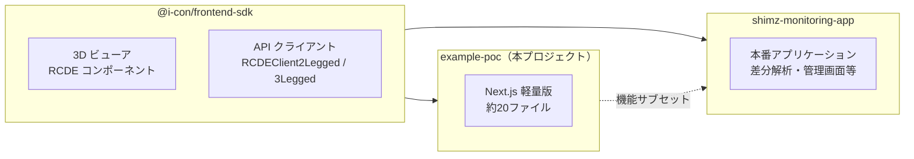

# A01: 設計思想

## 1. PoC の目的

本 PoC は、Autodesk Viewer SDK のように **Client ID と Client Secret さえあれば動作する**サンプルアプリケーションを提供することを目的とする。

RCDE アカウントを作成した開発者・建設業務担当者が、Docker や DB の構築なしに SDK の機能を即座に体験できる環境を実現する。

## 2. PoC の位置づけ

## 3. 設計判断

### Docker / DB 不要

- RCDE API がストレージ・認証・データ管理を提供するため、ローカル DB（PostgreSQL）やオブジェクトストレージ（MinIO）は不要
- 依存ツールを最小化し、`npm install && npm run dev` だけで起動可能にする

### Next.js 軽量版を採用

- `clientSecret` をブラウザに露出させないためにサーバーサイドが必要
- Next.js の API Route を使うことで、最小限のサーバーサイド機能を実現
- 純粋な SPA（Vite）では `clientSecret` のセキュリティを担保できない

### API SDK 統合

- 従来は `@i-con/api-sdk`（API クライアント）と `@i-con/frontend-sdk`（ビューア）の 2 パッケージに分かれていた
- 利用者の導入コストを下げるため、1 つのパッケージに統合
- 詳細は [D01: API SDK統合方針](../D_SDK統合設計/D01_API_SDK統合方針.md) を参照

## 4. モニタリングアプリとの関係

shimz-monitoring-app から以下の機能を除外し、SDK の能力を直接活用する軽量版:

- 差分解析（PCD Compare）
- 現場契約管理（DB ベースの AppSettings）
- メール通知（SES）
- ファイル共有・承認ワークフロー
- 管理画面（Admin / Superuser）
- WASM LAS パーサー

詳細な差分は [F02: モニタリングアプリとの差分](../F_開発ガイド/F02_モニタリングアプリとの差分.md) を参照。
