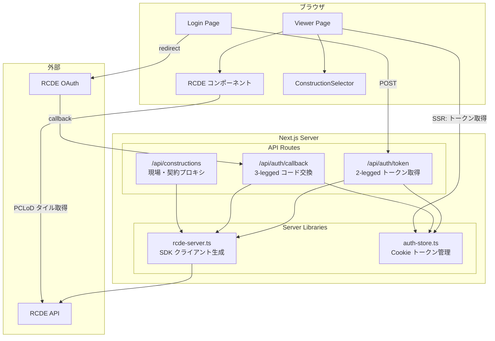

# B01: 全体アーキテクチャ

## 1. 構成図

## 2. サーバーサイド / クライアントサイドの責任分界

| レイヤー | 責務 | アクセスできる情報 |
|---|---|---|
| **サーバーサイド**（API Route, SSR） | 認証トークン交換、`clientSecret` 保護、API プロキシ | `RCDE_CLIENT_SECRET`, Cookie |
| **クライアントサイド**（React） | UI 描画、RCDE コンポーネント操作、ユーザー操作 | `accessToken`（Cookie から取得）、公開環境変数 |

`clientSecret` はサーバーサイドの `process.env` にのみ存在し、ブラウザには一切送信されない。

## 3. SDK との統合ポイント

- **`RCDE` コンポーネント**: `ViewerClient.tsx` でラップし、`RCDEAppConfig` を渡す
- **`RCDEClient2Legged` / `RCDEClient3Legged`**: サーバーサイド（API Route）でのみ使用
- **PCLoD タイル取得**: RCDE コンポーネント内部で `accessToken` + `baseUrl` を使って直接 RCDE API を呼ぶ

参照: [SDK 01_architecture.md](../../../../my-document_rcde-frontend-sdk/機能一覧仕様書/01_architecture.md)
