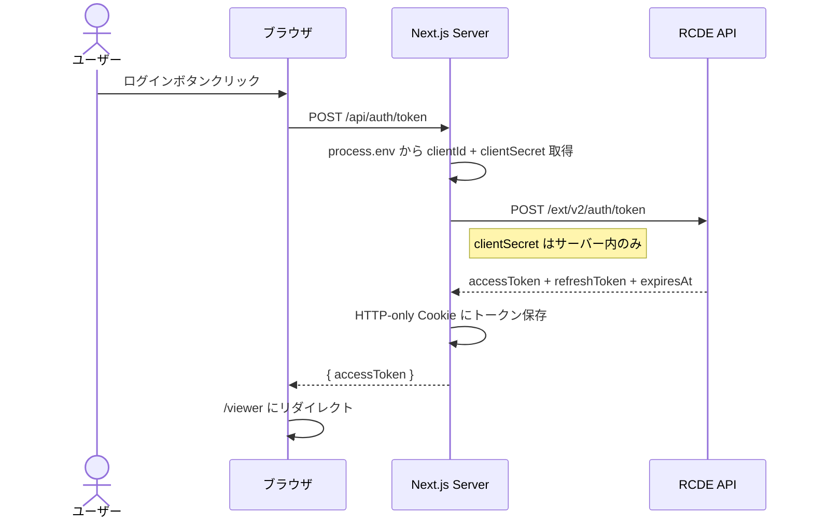
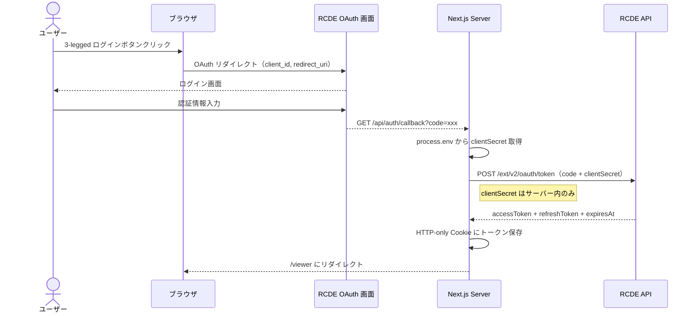

# C01: 認証フロー

## 1. 概要

本 PoC は 2 つの認証方式をサポートする:

- **2-legged**: Client ID + Client Secret でトークンを直接取得（M2M 通信向け）
- **3-legged**: ユーザーが RCDE のログイン画面で認証し、Authorization Code を経由してトークンを取得

いずれの場合も `clientSecret` はサーバーサイド（Next.js API Route）でのみ使用し、ブラウザには露出しない。

## 2. 2-legged 認証フロー

### API Route 実装

- エンドポイント: `POST /api/auth/token`
- SDK 使用: `RCDEClient2Legged.authenticate()`
- トークン保存: `auth-store.ts` の `storeToken()` で HTTP-only Cookie に保存

## 3. 3-legged 認証フロー

### API Route 実装

- エンドポイント: `GET /api/auth/callback?code=xxx`
- SDK 使用: `RCDEClient3Legged.authenticate(code)`
- トークン保存: `auth-store.ts` の `storeToken()` で HTTP-only Cookie に保存

## 4. clientSecret の保護

| 項目 | 実装 |
|---|---|
| 保存場所 | `process.env.RCDE_CLIENT_SECRET`（サーバーサイドのみ） |
| ブラウザへの露出 | なし（`NEXT_PUBLIC_` プレフィックスを付けない） |
| 使用箇所 | `src/lib/rcde-server.ts` でのみ参照 |
| API Route | `clientSecret` を含むリクエストはすべてサーバーサイドで処理 |

参照: [SDK 02_initialization.md](../../../../my-document_rcde-frontend-sdk/機能一覧仕様書/02_initialization.md)
