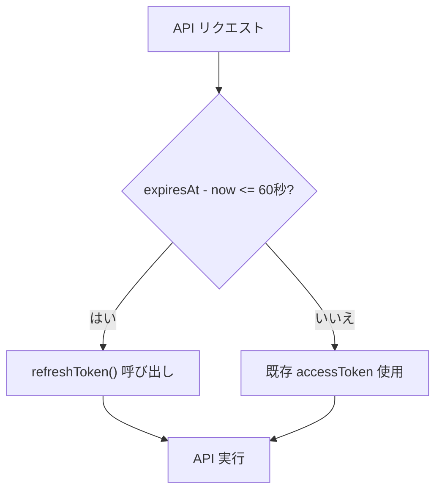

# C02: トークン管理

## 1. トークンの種類

| トークン | 用途 | 保存場所 |
|---|---|---|
| `accessToken` | API 認証ヘッダー (`Authorization: Bearer ...`) | HTTP-only Cookie `rcde_token` |
| `refreshToken` | accessToken の更新 | HTTP-only Cookie `rcde_refresh` |
| `expiresAt` | 有効期限（秒 since epoch） | HTTP-only Cookie `rcde_expires` |

## 2. Cookie 設定

```
HttpOnly: true     → JavaScript からアクセス不可（XSS 対策）
Secure: true       → HTTPS のみ（本番環境）
SameSite: lax      → CSRF 対策
MaxAge: 86400      → 24 時間
Path: /            → 全パスで有効
```

## 3. トークンリフレッシュ

### SDK の自動リフレッシュ機構

`RCDEClient3Legged` は自動リフレッシュを内蔵:



### PoC でのリフレッシュ方針

- サーバーサイド（API Route）で SDK クライアントを使用する場合、SDK の自動リフレッシュが働く
- クライアントサイド（RCDE コンポーネント）は `accessToken` を直接使用。期限切れ時は再ログインが必要

## 4. ログアウト

ログアウト時は Cookie をクリアする:

- `auth-store.ts` の `clearToken()` を呼び出し
- `/login` にリダイレクト
