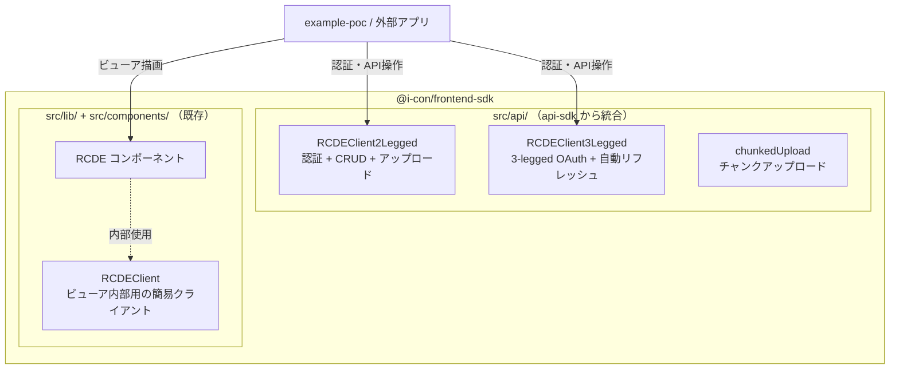

# D02: エクスポート構成

## 1. クライアントの関係

## 2. 公開エクスポート一覧

### 既存（変更なし）

| エクスポート | ソース | 用途 |
|---|---|---|
| `RCDE` | `src/components/RCDE.tsx` | メインビューアコンポーネント |
| `Viewer` | `src/components/Viewer.tsx` | 3D ビューア |
| `RCDEAppConfig` | `src/components/Viewer.tsx` | ビューア設定型 |
| `RCDEClient` | `src/lib/rcde-client.ts` | ビューア内部用クライアント |
| `ContractFileView` | `src/components/ContractFileView.tsx` | 契約ファイルビュー |
| `viewerBridge` | `src/bridge/viewerBridge.ts` | 外部制御ブリッジ |
| `ReferencePointProvider` | `src/contexts/referencePoint.tsx` | 基準点コンテキスト |
| `ClientProvider` | `src/contexts/client.tsx` | クライアントコンテキスト |
| `ContractFilesProvider` | `src/contexts/contractFiles.tsx` | 契約ファイルコンテキスト |
| `GlobalStateContext` | `src/contexts/state.ts` | グローバル状態 |

### 新規追加（api-sdk から統合）

| エクスポート | ソース | 用途 |
|---|---|---|
| `RCDEClient2Legged` | `src/api/client-2-legged.ts` | 2-legged 認証 API クライアント |
| `RCDEClient3Legged` | `src/api/client-3-legged.ts` | 3-legged 認証 API クライアント |
| `ClientProps3Legged` | `src/api/client-3-legged.ts` | 3-legged コンストラクタの型 |
| `Token` | `src/api/client-3-legged.ts` | トークン型 |
| `ClientProps` | `src/api/common.ts` | 共通コンストラクタの型 |
| `chunkedUpload` | `src/api/chunk-uploader.ts` | チャンクアップロード関数 |
| `Chunkable` | `src/api/chunk-uploader.ts` | アップロード可能な入力型 |

## 3. 後方互換性

- 既存の `RCDEClient`（`src/lib/rcde-client.ts`）はビューア内部のタイル取得に最適化されており、そのまま維持
- 新しい `RCDEClient2Legged` / `RCDEClient3Legged` は外部向けの完全な API クライアント
- 将来的に `RCDEClient` を廃止して統一することも可能だが、現時点では並行エクスポート
